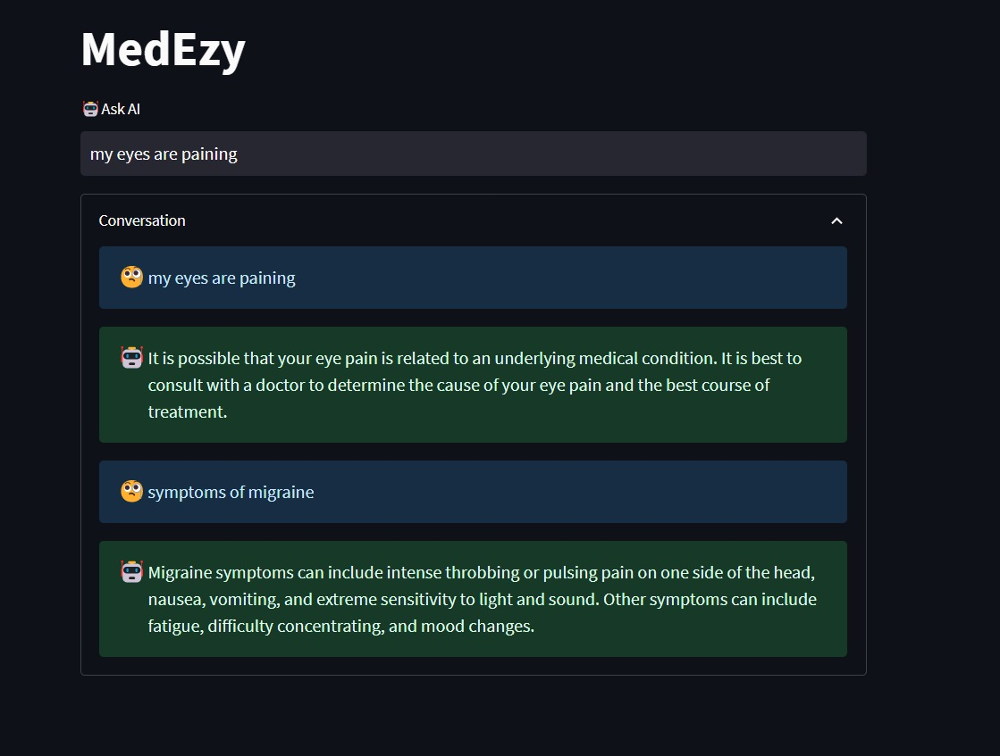

# Medezy Chatbot

Medezy is an AI-powered chatbot designed to assist with health-related queries, medical diagnosis, and provide tips and information on various medical topics. It utilizes OpenAI's language model, GPT-3.5, to deliver accurate and relevant responses.

## Features

- **Health Queries**: Ask Medezy about symptoms, conditions, medications, or general health concerns.
- **Diagnosis Assistance**: Receive guidance on potential diagnoses based on provided symptoms or information.
- **Medical Tips and Information**: Get helpful tips, recommendations, and information on a wide range of medical topics.

## How to Use

To interact with Medezy, follow these steps:

1. **Accessing the Chatbot**: simply visit medEzy website and start conversation

2. **Start Conversation**: Begin a conversation by typing queries or providing relevant information about health concerns.

3. **Receive Responses**: Medezy will provide responses based on the input provided, offering insights, advice, or information on the queried topic.

## Screenshots

Include screenshots here to demonstrate Medezy in action. Show examples of conversations, user interactions, or specific features of the chatbot.

## Examples

- *Asking about Symptoms*: "I have a headache and fever. What could it indicate?"
- *Querying Medications*: "What are the side effects of ibuprofen?"
- *General Health Tips*: "Can you suggest some healthy habits for better sleep?"

## Disclaimer

Medezy is an AI-driven system intended to provide information and assistance. However, it is not a substitute for professional medical advice, diagnosis, or treatment. Always consult with a qualified healthcare professional for accurate medical guidance.

## Contributing

Contributions to enhance the functionality, accuracy, or expand the knowledge base of Medezy are welcome! Feel free to submit pull requests, report issues, or suggest improvements.

## License

MIT License

Copyright (c) 2024 Prathamesh Desai

Permission is hereby granted, free of charge, to any person obtaining a copy
of this software and associated documentation files (the "Software"), to deal
in the Software without restriction, including without limitation the rights
to use, copy, modify, merge, publish, distribute, sublicense, and/or sell
copies of the Software, and to permit persons to whom the Software is
furnished to do so, subject to the following conditions:

The above copyright notice and this permission notice shall be included in all
copies or substantial portions of the Software.

THE SOFTWARE IS PROVIDED "AS IS", WITHOUT WARRANTY OF ANY KIND, EXPRESS OR
IMPLIED, INCLUDING BUT NOT LIMITED TO THE WARRANTIES OF MERCHANTABILITY,
FITNESS FOR A PARTICULAR PURPOSE AND NONINFRINGEMENT. IN NO EVENT SHALL THE
AUTHORS OR COPYRIGHT HOLDERS BE LIABLE FOR ANY CLAIM, DAMAGES OR OTHER
LIABILITY, WHETHER IN AN ACTION OF CONTRACT, TORT OR OTHERWISE, ARISING FROM,
OUT OF OR IN CONNECTION WITH THE SOFTWARE OR THE USE OR OTHER DEALINGS IN THE
SOFTWARE.
